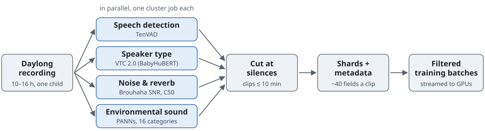
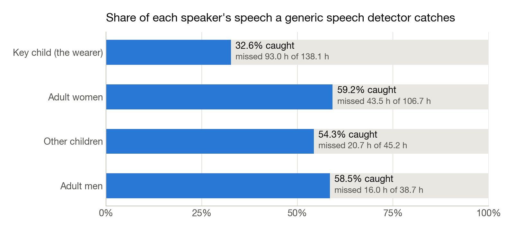
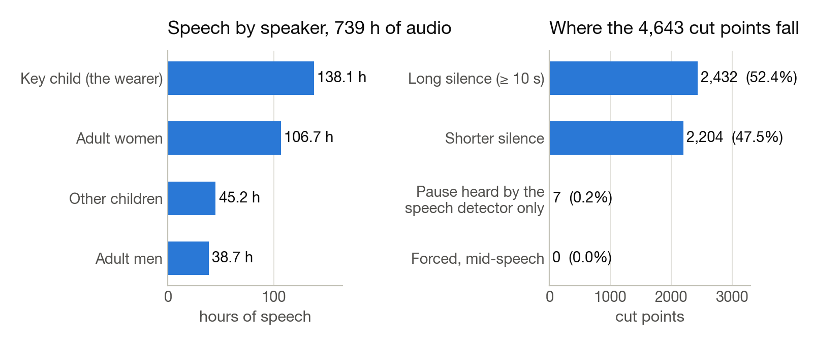

<h1 align="center">DL++</h1>
<p align="center"><b>Feature extraction and streaming data loading for daylong child audio recordings.</b></p>
<p align="center"><a href="pyproject.toml"></a> <a href="tests/"></a> <a href="LICENSE"></a> </p>

Children learn language from what they hear, and one way to study this is to record whole days of it: a small recorder worn in a vest captures up to sixteen hours at a time, over hundreds of days per corpus. Training speech models on such recordings differs from training on read speech. Most of a day is silence, noise or television; the child's own speech is quiet, short and scattered through the day; and a general-purpose speech detector, the standard first step, discards about two thirds of it. DL++ is a pipeline that prepares daylong recordings for model training. It runs four detectors over every recording in parallel on a cluster, cuts each recording into clips at detected silences, writes the clips as streamable shards with about forty metadata fields each, and streams them into training with filters on that metadata, such as a minimum signal-to-noise ratio or the presence of the child. It was built at the Cognitive Machine Learning lab at ENS Paris, in collaboration with Meta.

<p align="center"><picture><source media="(prefers-color-scheme: dark)" srcset="docs/figures/pipeline-dark.svg"></picture></p>

## Coverage of child speech by a generic detector

<p align="center"></p>
<p align="center"><sub>A general-purpose speech detector on one corpus. It catches most adult speech and misses 67% of the child's, 93 hours out of 138. A pipeline that starts from this detector loses most of the data it is meant to provide.</sub></p>

DL++ therefore runs a speaker-type model trained on child-centred recordings alongside the generic detector and records both outputs in the metadata. The choice between them is made at training time rather than at extraction.

## One corpus, end to end

| 52 | 739 h | 4,695 | 384,588 | 99.8% | < 1% |
|:---:|:---:|:---:|:---:|:---:|:---:|
| daylong recordings | of audio | clips | speaker turns | of 4,643 cut points in silence | storage overhead for metadata |

<p align="center"></p>
<p align="center"><sub>Speech by speaker in the corpus, and where the recordings were cut. No cut was forced mid-speech: 4,636 of the 4,643 cut points fall in silence detected by both detectors; the remaining seven fall in a pause detected by the speech detector only.</sub></p>

Each clip carries its own metadata record: speaker types and durations, signal-to-noise ratio, reverberation, the environmental sound categories present, and the turn structure. A training run can select clips on any of these fields. 77 GB of source audio become 79 GB of shards and about half a gigabyte of metadata.

## Streaming into training

The loader reads shards directly from disk or object storage, distributes them across nodes and workers without duplication, applies the metadata filters, and yields padded, batched tensors. A training job never holds a full recording in memory. The same shards feed [SMBS](https://github.com/danieldager/SMBS), the lab's benchmarking suite for the models trained on them.

## Scope and credit

- The speaker-type model is VTC 2.0 (BabyHuBERT) from the LAAC lab; this repository is a fork of theirs and retains their model figures. Users of the speaker model should cite Charlot, Kunze et al., [BabyHuBERT, arXiv:2509.15001](https://arxiv.org/abs/2509.15001) (BibTeX below).
- Speech detection is TenVAD; noise and reverberation are Brouhaha; environmental sound is PANNs.
- The corpus shown is SEEDLingS, which is access-restricted. No audio, transcripts or recording identifiers are in this repository.
- Phase 2 of 4: extraction and loading are complete; curriculum sampling and multi-corpus indexing are planned.

## Usage

```bash
git lfs install                                       # VTC-2.0 weights come from Hugging Face via git-lfs
git clone --recurse-submodules https://github.com/danieldager/DLplusplus.git && cd DLplusplus
uv sync                                               # Python 3.13; ffmpeg must be installed
uv run python scripts/download_brouhaha.py            # Brouhaha checkpoint, ~47 MB, once
uv run python scripts/make_manifest.py /path/to/audio -name my_data
uv run python -m src.pipeline.preflight my_data       # size, GPUs found, time estimate
export SBATCH_PARTITION=<partition>
bash slurm/pipeline.sh my_data                        # four detectors in parallel, then packaging
```

```python
from dataloader import DatasetConfig, FilterConfig, create_dataloader
config = DatasetConfig(dataset_dir="output/my_data",
                       filters=FilterConfig(min_snr_db=10.0, required_labels=["KCHI"]))
loader = create_dataloader(config)   # streams output/my_data/shards/*.tar
batch = next(iter(loader))           # batch.waveforms, batch.attention_mask, batch.snr_db
```

Every step, output and metadata field is documented in [docs/REFERENCE.md](docs/REFERENCE.md); the loader's design is in [docs/DATALOADER_DESIGN.md](docs/DATALOADER_DESIGN.md).

<details>
<summary>Citation</summary>

```bibtex
@misc{charlot2025babyhubertmultilingualselfsupervisedlearning,
    title={BabyHuBERT: Multilingual Self-Supervised Learning for Segmenting Speakers in Child-Centered Long-Form Recordings},
    author={Théo Charlot and Tarek Kunze and Maxime Poli and Alejandrina Cristia and Emmanuel Dupoux and Marvin Lavechin},
    year={2025},
    eprint={2509.15001},
    archivePrefix={arXiv},
    primaryClass={eess.AS},
    url={https://arxiv.org/abs/2509.15001},
}

@software{dlplusplus,
    title  = {{DL++}: Feature Processing and Data Loading for Child-Centered Long-Form Audio},
    author = {Dager, Daniel and Kunze, Tarek and Charlot, Théo and Cristia, Alejandrina and Dupoux, Emmanuel and Lavechin, Marvin},
    year   = {2026},
    url    = {https://github.com/danieldager/DLplusplus},
}
```
</details>

Issues and pull requests are welcome.
