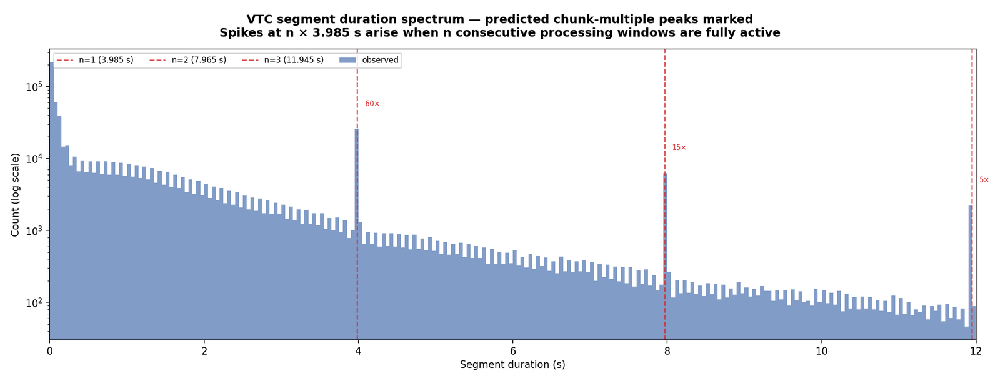
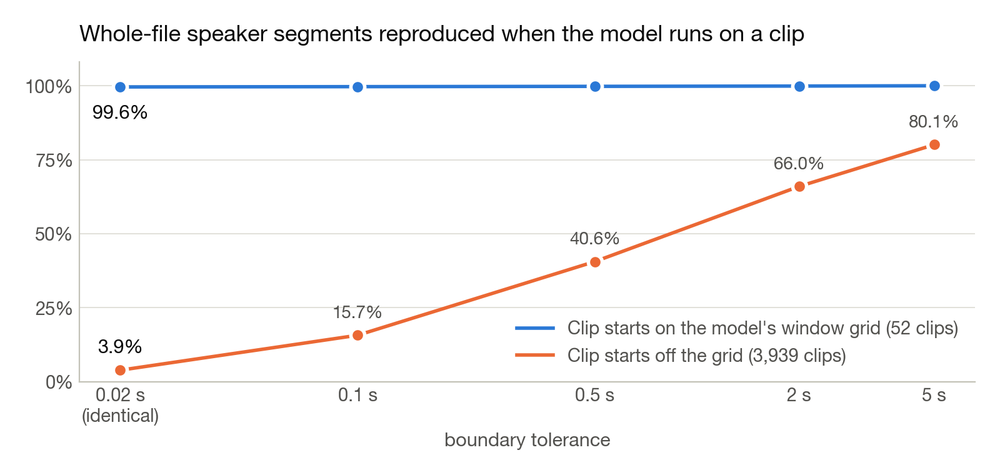

<h1 align="center">DL++</h1>
<p align="center"><b>From a child's whole day of audio to a training batch, without losing the child.</b></p>
<p align="center"><a href="pyproject.toml"></a> <a href="tests/"></a> <a href="LICENSE"></a> </p>

Children learn language from what they hear, so the lab records whole days of it: a small recorder in a vest, sixteen hours at a time, hundreds of days per corpus. Training speech models on that audio is nothing like training on audiobooks. Most of a day is silence, noise or television. The child's own voice is quiet, short and everywhere. And a generic speech detector, the first tool anyone reaches for, throws away two thirds of it. DL++ is the pipeline that turns daylong recordings into something a model can learn from: it runs four detectors over every recording in parallel on the cluster, cuts the day into clips at detected silences, writes the clips as streamable shards with forty fields of metadata each, and streams them into training with filters like "at least this quiet" or "the child must be in it". Built at the Cognitive Machine Learning lab at ENS Paris, in collaboration with Meta.

<p align="center"><picture><source media="(prefers-color-scheme: dark)" srcset="docs/figures/pipeline-dark.svg"></picture></p>

## The child is the hard part

<p align="center"></p>
<p align="center"><sub>A general-purpose speech detector on one corpus: it catches most adult speech and misses 67% of the child's, 93 hours out of 138. Any pipeline that starts with it has already lost the data it was built for.</sub></p>

DL++ therefore runs a speaker-type model trained on child recordings alongside the generic detector, and keeps both verdicts in the metadata. Which one to trust becomes a choice at training time, not at extraction.

## One corpus, end to end

| 52 | 739 h | 4,695 | 384,588 | 99.8% | < 1% |
|:---:|:---:|:---:|:---:|:---:|:---:|
| daylong recordings | of audio | clips | speaker turns | of 4,643 cut points in silence | storage overhead for metadata |

<p align="center"></p>
<p align="center"><sub>Speech by speaker in the corpus, and where the recordings were cut. No cut was forced mid-speech: 4,636 of the 4,643 cut points sit in silence both detectors agree on, the other seven in a pause the speech detector hears.</sub></p>

Each clip carries its own record: who speaks and for how long, signal-to-noise ratio, reverberation, the sixteen environmental sound categories present, the turn structure. A training run selects on any of it. Seventy-seven gigabytes of source audio become seventy-nine of streamable shards plus half a gigabyte of metadata.

## A four-second ghost

<p align="center"></p>

The speaker-type model's segments had a rhythm nobody had put there. Their lengths piled up at multiples of 3.985 seconds, sixty times above baseline at four seconds. The cause was the model's own sliding window. It is harmless on a whole file and destructive once the file is cut into clips: a clip whose start does not fall on that grid gets different predictions from the same audio.

<p align="center"></p>
<p align="center"><sub>Clips snapped to the model's window grid reproduce the whole-file predictions 99.6% of the time. Misaligned clips: 3.9%.</sub></p>

DL++ now snaps every cut point to that grid. The fix is three lines. Finding it took reading a histogram nobody expected to be interesting.

## Streaming into training

The loader reads shards straight from disk or object storage, splits them across nodes and workers with no duplication, applies the metadata filters, and yields padded, batched tensors. A training job never holds a recording in memory. The same shards feed [SMBS](https://github.com/danieldager/SMBS), the lab's benchmarking suite for the models trained on them.

## Scope and credit

- Built on the VTC 2.0 speaker-type model and BabyHuBERT from the LAAC lab, forked from their repository, which also provided the model figures. Cite them if you use the speaker model: Charlot, Kunze et al., [BabyHuBERT, arXiv:2509.15001](https://arxiv.org/abs/2509.15001) (BibTeX below).
- Speech detection is TenVAD; noise and reverberation are Brouhaha; environmental sound is PANNs.
- The corpus shown is SEEDLingS, which is access-restricted. No audio, transcripts or recording identifiers are in this repository.
- Phase 2 of 4: extraction and loading are done; curriculum sampling and multi-corpus indexing are next.

## Use it

```bash
git lfs install                                       # VTC-2.0 weights come from Hugging Face via git-lfs
git clone --recurse-submodules https://github.com/danieldager/DLplusplus.git && cd DLplusplus
uv sync                                               # Python 3.13; ffmpeg must be installed
uv run python scripts/download_brouhaha.py            # Brouhaha checkpoint, ~47 MB, once
uv run python scripts/make_manifest.py /path/to/audio -name my_data
uv run python -m src.pipeline.preflight my_data       # size, GPUs found, time estimate
export SBATCH_PARTITION=<partition>
bash slurm/pipeline.sh my_data                        # four detectors in parallel, then packaging
```

```python
from dataloader import DatasetConfig, FilterConfig, create_dataloader
config = DatasetConfig(dataset_dir="output/my_data",
                       filters=FilterConfig(min_snr_db=10.0, required_labels=["KCHI"]))
loader = create_dataloader(config)   # streams output/my_data/shards/*.tar
batch = next(iter(loader))           # batch.waveforms, batch.attention_mask, batch.snr_db
```

Every step, output and metadata field is documented in [docs/REFERENCE.md](docs/REFERENCE.md); the loader's design is in [docs/DATALOADER_DESIGN.md](docs/DATALOADER_DESIGN.md).

<details>
<summary>Citation</summary>

```bibtex
@misc{charlot2025babyhubertmultilingualselfsupervisedlearning,
    title={BabyHuBERT: Multilingual Self-Supervised Learning for Segmenting Speakers in Child-Centered Long-Form Recordings},
    author={Théo Charlot and Tarek Kunze and Maxime Poli and Alejandrina Cristia and Emmanuel Dupoux and Marvin Lavechin},
    year={2025},
    eprint={2509.15001},
    archivePrefix={arXiv},
    primaryClass={eess.AS},
    url={https://arxiv.org/abs/2509.15001},
}

@software{dlplusplus,
    title  = {{DL++}: Feature Processing and Data Loading for Child-Centered Long-Form Audio},
    author = {Dager, Daniel and Kunze, Tarek and Charlot, Théo and Cristia, Alejandrina and Dupoux, Emmanuel and Lavechin, Marvin},
    year   = {2026},
    url    = {https://github.com/danieldager/DLplusplus},
}
```
</details>

Issues and pull requests are welcome, especially from people who work with long-form recordings.
